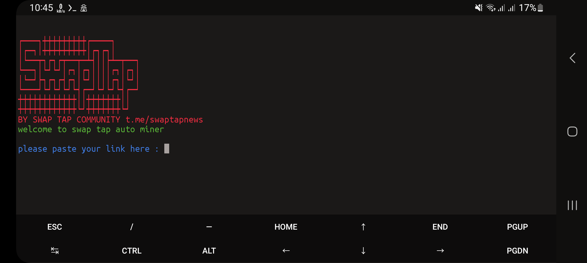

# EtswapTap
Tap swap telegram bot automation tool 



## **Usage**
Clone the Repository and run the program 
```bash
git clone https://github.com/Elphador/SwapTap.git
cd SwapTap
pip install -r requirements.txt
python3 swap-tap.py
```
CTRL + C to end the program 

### Warning⚠️
No one is responsible for anything happens by using this tool 

## [Telegram Support Channel ](https://t.me/swaptapnews)
